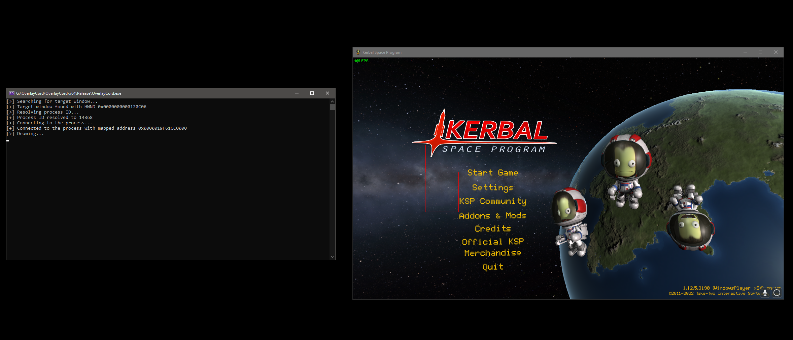

# OverlayCord
This project is a simple proof of concept that shows you how to hijack Discord's internal game overlay from an external process without modifying any Discord files, loading any Discord modules, or hooking anything.

## How does it work?
Discord's whitelisted internal module (DiscordHook64.dll), which is loaded by games using SetWindowHookEx, simply copies the framebuffer from a memory-mapped file. The code snippet from this repo is pretty much self-explanatory:

```
typedef struct _Header
{
	UINT Magic;
	UINT FrameCount;
	UINT NoClue;
	UINT Width;
	UINT Height;
	BYTE Buffer[1]; // B8G8R8A8
} Header;

bool ConnectToProcess(ConnectedProcessInfo& processInfo)
{
	std::string mappedFilename = "DiscordOverlay_Framebuffer_Memory_" + std::to_string(processInfo.ProcessId);
	processInfo.File = OpenFileMappingA(FILE_MAP_ALL_ACCESS, false, mappedFilename.c_str());
	if (!processInfo.File || processInfo.File == INVALID_HANDLE_VALUE)
		return false;

	processInfo.MappedAddress = static_cast<Header*>(MapViewOfFile(processInfo.File, FILE_MAP_ALL_ACCESS, 0, 0, 0));
	return processInfo.MappedAddress;
}
```
Please note that this straightforward example **uses very basic CPU rendering**, which does not offer optimal performance. In addition, regardless of your intention to use GPU rendering (such as DirectX), **the framebuffer will still be copied by the CPU**.

## Media
[](https://www.youtube.com/watch?v=T2uftl9C9p8)
*Video showing the example*


**Image showing the example*

